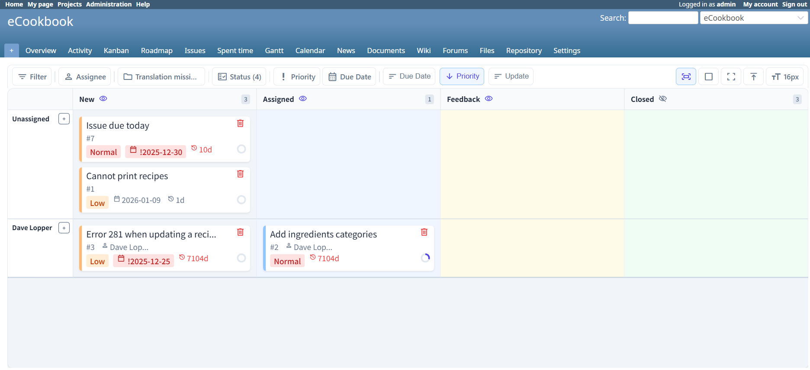
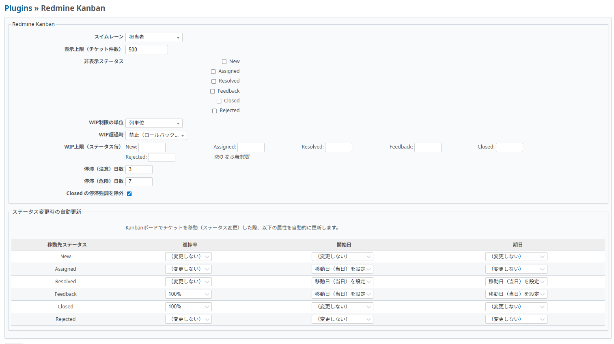

# Redmine Kanban

Redmine の運用を強化する、React + Vite で構築されたモダンなカンバンボードプラグインです。
単なる「タスクの見える化」ではなく、WIP 制限や停滞検知などでフロー効率を高めます。

[English version is here](README.md) | [セットアップ](../../SETUP.md) | [要件定義](../../requirement.md)

## 目次

- [概要](#概要)
- [主な特徴](#主な特徴)
- [スクリーンショット](#スクリーンショット)
- [クイックスタート（Docker Compose）](#クイックスタートdocker-compose)
- [Redmine プラグインとして導入](#redmine-プラグインとして導入)
- [利用方法](#利用方法)
- [設定](#設定)
- [技術スタック](#技術スタック)
- [開発](#開発)
- [テスト](#テスト)
- [API エンドポイント](#api-エンドポイント)
- [CI（E2E）](#cie2e)
- [ライセンス](#ライセンス)

## 概要

Redmine Kanban は、作業の滞留を早期に可視化し、チームのフローを守るためのプラグインです。
直感的な操作感と高い描画性能により、日々の運用をスムーズにします。

## 主な特徴

- **Canvas 描画**: HTML Canvas による高パフォーマンスなボード描画。大量データでもスムーズ。
- **WIP 制御**: 列や担当者ごとの WIP を制限し、超過時の動作（禁止/警告）を設定可能。
- **停滞検知 (Aging)**: 長期間更新されていないタスクを視覚的に強調。閾値を調整可能。
- **スイムレーン**: 担当者または優先度でレーンを切り替え可能（レーンなし表示にも対応）。
- **ドラッグ&ドロップ**: Redmine のワークフローに準拠したステータス遷移をサポート。子チケット表示エリア上からもカードをつかんで移動可能。
- **高度なフィルタリング**: 担当者、期限、優先度、Blocked 状態などで絞り込み可能。
- **Kanban からの直接作成**: 列ヘッダやセルから新規チケットを作成可能。
- **再帰サブタスク表示**: 子・孫以降を含むサブタスク階層をインデント表示し、完了状態のトグルが可能。
- **Undo 機能**: 誤って削除したタスクを復元可能。
- **プロジェクトフィルタ**: 複数プロジェクトやサブプロジェクトでフィルタリング可能。

## スクリーンショット




## クイックスタート（Docker Compose）

フルリポジトリを利用する場合は、リポジトリルートの Docker Compose を使用します。

```bash
cd ../..
docker compose up -d
```

アクセス先: [http://localhost:3002](http://localhost:3002)

- ログインID: `admin`
- パスワード: `admin`

## Redmine プラグインとして導入

既存の Redmine に導入する場合は、以下の手順で利用できます。

1. このプラグインを Redmine の `plugins/` 配下に `redmine_kanban` として配置。
2. Redmine を再起動。
3. 対象プロジェクトで **Kanban** モジュールを有効化。

フロントエンドを変更した場合は、`plugins/redmine_kanban/frontend` でビルドしてから再起動してください。

```bash
cd plugins/redmine_kanban/frontend
pnpm install
pnpm run typecheck
pnpm run build
```

## 利用方法

1. Redmine にログイン後、プロジェクトを作成します。
2. 「設定」→「モジュール」で **Kanban** を有効化します。
3. プロジェクトメニューの **Kanban** を開きます。

## 設定

プラグイン設定画面で以下を調整できます。

- **スイムレーンタイプ**: なし/担当者/優先度
- **チケット表示上限**: ボードに表示するチケット数
- **非表示ステータス**: ボードに表示しないステータス
- **WIP 制限モード**: 列単位/列×レーン単位
- **WIP 超過時の動作**: 禁止/警告のみ
- **停滞閾値**: 注意・危険レベルの日数設定
- **ステータス自動更新**: カード移動時のステータス自動変更ルール

## 技術スタック

| レイヤー | 技術 |
| --- | --- |
| バックエンド | Ruby on Rails (Redmine プラグイン) |
| フロントエンド（カンバン） | React 18 + TypeScript + Vite + Canvas |
| コンテナ | Docker Compose |
| データベース | PostgreSQL (Redmine 標準) |

## 開発

フロントエンド（SPA 部分）のソースコードは `plugins/redmine_kanban/frontend` にあります。

```bash
cd plugins/redmine_kanban/frontend
pnpm install
pnpm run test -- --run
pnpm run typecheck
pnpm run build
```

`pnpm` を使わない環境では `npm ci` / `npm run ...` でも実行できます（`frontend/package-lock.json` 同梱）。

ビルド完了後、Redmine コンテナを再起動して変更を反映します。

```bash
cd ../..
docker compose restart redmine
```

## テスト

バックエンド（Ruby）のテスト:

```bash
docker compose exec redmine bundle exec rails test plugins/redmine_kanban/test
```

フロントエンドのユニットテスト / 型チェック:

```bash
cd plugins/redmine_kanban/frontend
pnpm run test -- --run
pnpm run typecheck
```

Playwright E2E（ローカル実行）:

```bash
npm install --prefix e2e
npx --prefix e2e playwright install chromium

# Redmine 起動（プラグインルートで実行）
docker compose -f .github/e2e/docker-compose.yml up -d

# Redmine 初期化（初回）
docker compose -f .github/e2e/docker-compose.yml exec -T redmine \
  bundle exec rake db:migrate redmine:plugins:migrate RAILS_ENV=production
docker compose -f .github/e2e/docker-compose.yml exec -T redmine \
  env REDMINE_LANG=en bundle exec rake redmine:load_default_data RAILS_ENV=production
docker compose -f .github/e2e/docker-compose.yml exec -T redmine \
  bundle exec rails runner -e production plugins/redmine_kanban/e2e/setup_redmine.rb

# E2E 実行
REDMINE_BASE_URL=http://127.0.0.1:3002 \
  npx --prefix e2e playwright test -c e2e/playwright.config.js
```

## API エンドポイント

| メソッド | パス | 説明 |
| --- | --- | --- |
| GET | `/projects/:project_id/kanban/data` | ボードデータ取得 |
| PATCH | `/projects/:project_id/kanban/issues/:id/move` | カード移動 |
| POST | `/projects/:project_id/kanban/issues` | チケット作成 |
| PATCH | `/projects/:project_id/kanban/issues/:id` | チケット更新 |
| DELETE | `/projects/:project_id/kanban/issues/:id` | チケット削除 |

ボードデータ補足:

- `issues[].subtasks` は再帰ツリー構造です（`subtasks[].subtasks...`）。
- Canvas 上の子チケット行はフロントで描画/ヒット判定用にフラット化していますが、API は階層を保持します。

関連する画面ルート:

| メソッド | パス | 説明 |
| --- | --- | --- |
| GET | `/projects/:project_id/kanban` | カンバン画面 |
| GET | `/projects/:project_id/gantt` | カンバン画面へのリダイレクト（プラグイン側） |

## CI（E2E）

GitHub Actions ワークフロー: `.github/workflows/e2e-kanban.yml`

CI では以下を実行します。

- `e2e/` の依存関係インストール
- `.github/e2e/docker-compose.yml` で Redmine 起動
- マイグレーションと Redmine 初期データ投入
- `e2e/setup_redmine.rb` による `ecookbook` プロジェクト/モジュールのシード
- Playwright スモークテスト（`e2e/tests/kanban-smoke.spec.js`）

## ライセンス

本プロジェクトは GNU General Public License v2.0 (GPLv2) の下で公開されています。
