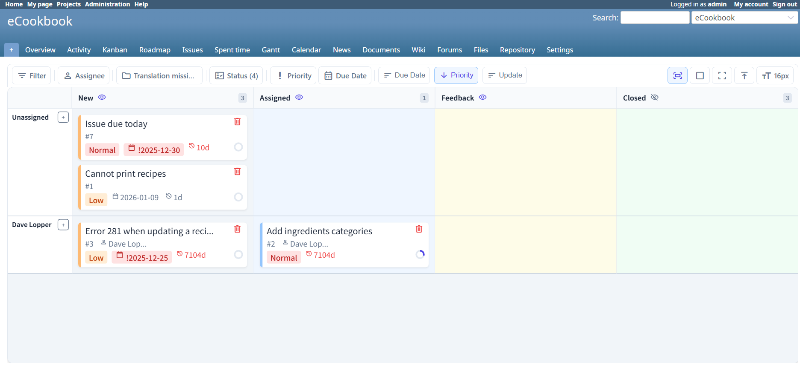
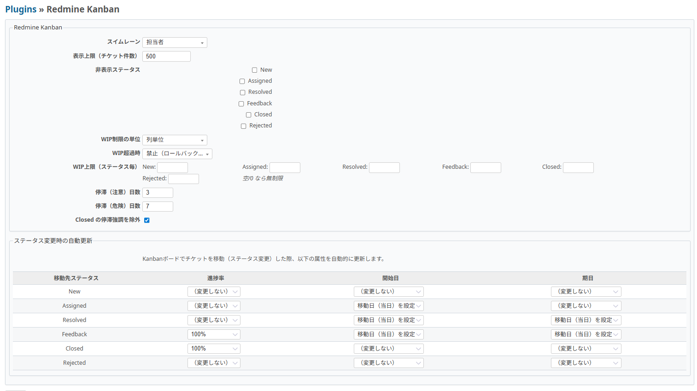

# Redmine Kanban

Modern Kanban board plugin for Redmine, built with React + Vite.
It provides task visualization, per-user display preferences, aging detection, and flow-focused controls.

[日本語版はこちら](README.ja.md) | [Setup](../../SETUP.md) | [Requirements](../../requirement.md)

## Table of Contents

- [Overview](#overview)
- [Key Features](#key-features)
- [Screenshots](#screenshots)
- [Quick Start (Docker Compose)](#quick-start-docker-compose)
- [Install as a Redmine Plugin](#install-as-a-redmine-plugin)
- [Usage](#usage)
- [Configuration](#configuration)
- [Technology Stack](#technology-stack)
- [Development](#development)
- [Testing](#testing)
- [API Endpoints](#api-endpoints)
- [CI](#ci)
- [License](#license)

## Overview

Redmine Kanban helps teams keep flow healthy and visible by exposing stalled work and letting teams move issues quickly with minimal friction.

## Key Features

- **Canvas-Based Rendering**: High-performance board rendering using HTML Canvas for smooth scrolling and large dataset handling.
- **Aging Detection**: Highlight tasks that have not been updated for a long time. Thresholds are stored in each user's display preferences.
- **Swimlanes**: Switch lanes by assignee or priority (or disable lanes for a single-row board).
- **Drag & Drop**: Intuitive card movement with Redmine workflow-aware status transitions. Cards can also be grabbed from the subtask area.
- **Advanced Filtering**: Filter by tracker, assignee, due date, priority, blocked status, and more. Selecting trackers projects the board columns to their workflow statuses.
- **Direct Creation from Board**: Create new tickets from column headers or cells during standups.
- **Nested Subtask Display**: View subtasks recursively (child / grandchild / deeper) either inside parent cards or as separate cards, and toggle completion.
- **Recreate Deleted Issue**: Recreate a deleted top-level issue with the displayed content. It creates a new issue; history, comments, attachments, relations, watchers, and the original ID are not restored.
- **Project Filter**: Filter across projects and subprojects.

## Screenshots




## Quick Start (Docker Compose)

If you cloned the full repository, use the Docker Compose environment from the repo root:

```bash
cd ../..
docker compose up -d
```

Access Redmine at [http://localhost:3002](http://localhost:3002) with:

- Login: `admin`
- Password: `admin`

## Install as a Redmine Plugin

Use these steps when you want to install the plugin into an existing Redmine instance:

1. Copy this plugin into your Redmine `plugins/` directory as `redmine_kanban`.
2. Restart Redmine.
3. In Redmine, enable the **Kanban** module for your project.

If you modify the frontend, build assets from `plugins/redmine_kanban/frontend` before restarting:

```bash
cd plugins/redmine_kanban/frontend
pnpm install
pnpm run typecheck
pnpm run build
```

## Usage

1. Create or open a project in Redmine.
2. Enable **Kanban** in Project Settings → Modules.
3. Open the **Kanban** tab from the project menu.

## Display preferences

There is no plugin-wide configuration screen. Each user can set swimlanes, hidden statuses, aging thresholds, sorting, fit mode, font size, subtask display, and the maximum board entity count from the board. The default maximum is 1,500 unique Issue entities; blank or invalid values return to 1,500. Card moves only apply the status and any lane attribute explicitly selected by the user; Redmine workflow and permissions remain authoritative.

Board data is one complete snapshot for the requested project/status scope. Membership is the unique union of primary Issues and dependency-only descendants needed to represent those primaries; even an exact primary-limit boundary probes for descendants. The configured count is an admission limit, not a page size: if the complete scope exceeds it, the API returns a structured 422 error and no Issue entities. The server applies the lower of the requested limit and `REDMINE_KANBAN_MAX_BOARD_ENTITIES` (default 5,000), and also enforces `REDMINE_KANBAN_MAX_RESPONSE_BYTES` (default 8 MiB) and `REDMINE_KANBAN_MAX_BOARD_QUERIES` (default 20). Set `REDMINE_KANBAN_PERF_LOG=1` to log snapshot resource measurements. There is no Load more, cursor, offset, or subtree recovery operation.

## Technology Stack

| Layer | Technology |
| --- | --- |
| Backend | Ruby on Rails (Redmine plugin) |
| Frontend | React 18 + TypeScript + Vite + Canvas |
| Container | Docker Compose |
| Database | PostgreSQL (Redmine standard) |

## Development

Frontend source code is in `plugins/redmine_kanban/frontend`.

```bash
cd plugins/redmine_kanban/frontend
pnpm install
pnpm run test -- --run
pnpm run typecheck
pnpm run build
```

If your environment does not use `pnpm`, `npm ci` / `npm run ...` also works (`frontend/package-lock.json` is included).

To capture reproducible tree resource metrics against a seeded Redmine project:

```bash
REDMINE_KANBAN_BENCHMARK_PROJECT=ecookbook \
  docker compose -f .github/e2e/docker-compose.yml exec -T redmine \
  bundle exec rails runner -e production plugins/redmine_kanban/script/benchmark_tree.rb
```

Restart the Redmine container after rebuilding assets:

```bash
cd ../..
docker compose restart redmine
```

## Testing

Backend (Ruby) tests:

```bash
docker compose exec redmine bundle exec rails test plugins/redmine_kanban/test
```

Frontend unit tests / type checking:

```bash
cd plugins/redmine_kanban/frontend
pnpm run test -- --run
pnpm run typecheck
```

Playwright E2E (local):

```bash
npm install --prefix e2e
npx --prefix e2e playwright install chromium

# Start Redmine stack (from plugin root)
docker compose -f .github/e2e/docker-compose.yml up -d

# Initialize Redmine data (first run)
docker compose -f .github/e2e/docker-compose.yml exec -T redmine \
  bundle exec rake db:migrate redmine:plugins:migrate RAILS_ENV=production
docker compose -f .github/e2e/docker-compose.yml exec -T redmine \
  env REDMINE_LANG=en bundle exec rake redmine:load_default_data RAILS_ENV=production
docker compose -f .github/e2e/docker-compose.yml exec -T --user redmine redmine \
  bundle exec rails runner -e production plugins/redmine_kanban/e2e/setup_redmine.rb

# Run E2E
REDMINE_BASE_URL=http://127.0.0.1:3002 \
  npx --prefix e2e playwright test -c e2e/playwright.config.js
```

## API Endpoints

| Method | Path | Description |
| --- | --- | --- |
| GET | `/projects/:project_id/kanban/data` | Get board data |
| PATCH | `/projects/:project_id/kanban/issues/:id/move` | Move card |
| POST | `/projects/:project_id/kanban/issues` | Create ticket |
| POST | `/projects/:project_id/kanban/issues/bulk` | Create a parent with subtasks or subtasks for an existing parent |
| PATCH | `/projects/:project_id/kanban/issues/:id` | Update ticket |
| DELETE | `/projects/:project_id/kanban/issues/:id` | Delete ticket |
| GET | `/projects/:project_id/kanban/issues/entities?ids[]=...` | Reconcile selected flat Issue entities |

Board data notes:

- Contract version 3 returns flat `entities` exactly once per Issue plus `tree.root_ids` and `tree.children_by_parent_id`; the frontend derives recursive Canvas rows from normalized state.
- `lists.trackers` includes additive `workflow_status_ids`, `default_status_id`, and `available_project_ids` metadata. A single selected tracker is propagated to Native Redmine Create only when it is available in the target project; incomplete metadata fails open.
- Drag drop colors are workflow guidance from the snapshot. NOOP drops are suppressed, while allowed, denied, and unknown drops still use the existing mutation path so Redmine remains the final Workflow authority. Workflow rejection responses use `WORKFLOW_TRANSITION_NOT_ALLOWED` and trigger one targeted entity reconciliation without retrying.
- `board_entity_limit` is the only board size request parameter. `offset`, `cursor`, `tree_parent_id`, and `issue_limit` are rejected; no partial snapshot is successful.
- Mutation responses use contract version 3 fields (`operation_id`, `scope_fingerprint`, flat `issue_updates`/`created_issues`, `deleted_issue_ids`, `tree_changes`, and invalidations). The frontend applies these deltas to normalized state and uses the entities endpoint for targeted reconciliation.
- `scope_fingerprint` is an opaque identity for board project, current user, sanitized project scope, primary status scope, and dependency status scope; its exact hash value is not a public compatibility contract. Plugin mutations use the same scope and admission parameters. Native Redmine iframe writes cannot produce a trusted delta, so successful issue/journal saves (including composite bulk-subtask operations) reset the current board query to one complete snapshot; a refresh failure is reported as a board loading problem, not a save failure.
- Issue responses are accepted only when their `lock_version`/`updated_on` freshness is not older than the cached entity. Optimistic failures roll back only fields still holding that mutation's optimistic values; overlapping mutations trigger targeted server reconciliation.
- Deleted Issue recreation is available only for domain top-level Issues. It creates a new Issue with the displayed subject, project, description, status, assignee, tracker, priority, dates, and done ratio; it never recreates a child Issue without its parent.

Bulk creation uses `Rails.cache` for idempotency. The cache identity is scoped by user, project, operation, `Idempotency-Key`, and a canonical digest of the request payload; an atomic claim means only the claimant runs creation, while processing and completed entries reject a different payload or return the previous response for the same payload. The client reuses the key for the same logical operation during a browser session. Failed validation or exceptions remove the claim so the same operation can be retried.

Bulk creation accepts at most 50 non-empty subtasks per request; requests with 51 or more are rejected before the transaction starts.

The guarantee covers duplicate submissions from one browser, retries of the same logical operation during that browser session, duplicate claims within one Redmine process, and duplicate claims across processes when the cache store provides an atomic shared `unless_exist` write. It does not provide persistent exactly-once behavior across MemoryStore process boundaries, cache loss, or server restarts.

This plugin intentionally has no database migrations or plugin-owned tables. Exactly-once persistence cannot be guaranteed when the cache is lost, the server restarts, or separate processes use non-shared stores such as per-process MemoryStore. Deployments requiring that stronger guarantee must provide a shared atomic/persistent CacheStore or an external idempotency service.

## CI

GitHub Actions workflow: `.github/workflows/e2e-kanban.yml`

The CI workflow runs:

- frontend `build`
- frontend `lint`
- frontend `typecheck`
- frontend unit tests with Vitest
- Redmine 7.0 MariaDB full Ruby/API tests and the snapshot contract gate
- PostgreSQL 16 membership/admission integration, with unit and focused API suites using separate Rails test selectors
- Playwright E2E on Redmine 7.0 and Redmine 6.1, including the native Redmine iframe save/reset lifecycle
- Playwright compatibility smoke test on Redmine 6.0
- deterministic snapshot admission gates for deep-tree, exact-limit dependency membership, response bytes, and query limits (`board_data_test.rb`, `snapshot_limits_test.rb`, and `api_controller_test.rb`)
- a Redmine 7.0 actual-DB large-data gate using the 1,505-child high-fan-out fixture; it checks limit/over-limit admission, unique entities, materialized rows, query count, response bytes, and the absence of partial entities

The main Redmine test and browser jobs use MariaDB 10 via `.github/e2e/docker-compose.yml`; the PostgreSQL membership job uses `.github/e2e/docker-compose.postgres.yml` and runs the resolver/admission integration suite. Browser jobs run migrations, load default data, seed `ecookbook` and the isolated `kanban-native` project via `e2e/setup_redmine.rb`, and upload Playwright reports on completion.

The verification entry points live under `script/ci/` so local container runs and CI use the same suite boundaries: `ruby-full.sh`, `snapshot-contract.sh`, `postgres-unit.sh`, `postgres-api.sh`, `e2e-full.sh`, `native-mutation-e2e.sh`, `large-data-e2e.sh`, and `compatibility-smoke.sh`.

## License

Plugin code: GPLv2. Bundled third-party fonts: see [THIRD_PARTY_LICENSES.md](THIRD_PARTY_LICENSES.md).

This project is licensed under the GNU General Public License v2.0 (GPLv2).
